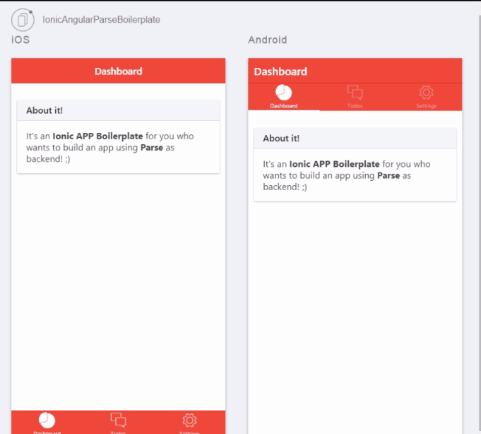

# IonicAngularParseBoilerplate
Ionic App with [Parse](https://parse.com/) as Backend (using Angular Parse library) Boilerplate

## App
ToDo List



### Requirements
- [NodeJS](https://nodejs.org/)
- [Ionic](http://ionicframework.com/)

### Dependencies
- [Gulp](http://gulpjs.com/)
- [Bower](http://bower.io/)
- [Angular Parse](https://github.com/jimrhoskins/angular-parse)

### Features
- :white_check_mark: Ionic Tabs Layout 
- :white_check_mark: Ionic Page Refresher
- :white_check_mark: Ionic Popup
- :white_check_mark: Parse CRUD
- :white_check_mark: Parse Relationship between Models
- Parse Login
- Parse Push Notifications

### Contributing
Learn how to contribute with this repository [here](CONTRIBUTING.md).

### Usage

Just clone this *repo* and change whatever you want!

### Install
`npm install`

### Parse Configuration
In **www/js/app.js** search for:
```javascript
// initialize Parse
  return ParseProvider.initialize(
    "YOUR_APP_ID", //App ID
    "YOUR_REST_API_KEY"  //REST API Key
  );
```
Change these values with the values from your Parse app

### Run
- Runs full browser

`ionic serve`

- Runs comparison, side by side, between iOS and Android versions

`ionic serve --lab`

- Launch emulator/simulator, deploy and execute your app

`ionic run [ios/android] --emulator`

- Launch App on emulator/simulator with **livereload**

`ionic run [ios/android] --emulator --livereload`

### License
See [here](https://github.com/giorgiofellipe/IonicAngularParseBoilerplate/blob/master/LICENSE).
